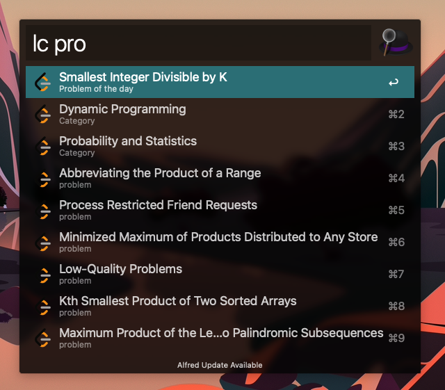

# Leetcode Alfred plugin
An ultra-fast Leetcode search workflow for [Alfred 3+](https://www.alfredapp.com/).




## Installation

1. [Download the latest version](https://github.com/ahmedash95/leetcode-alfred-plugin/releases)
2. Install the workflow by double-clicking the `.alfredworkflow` file
3. You can add the workflow to a category, then click "Import" to finish importing. You'll now see the workflow listed in the left sidebar of your Workflows preferences pane.

## Usage

Just type `lc` followed by your search query.

```
ld <query>
ld stack
ld two sum
```